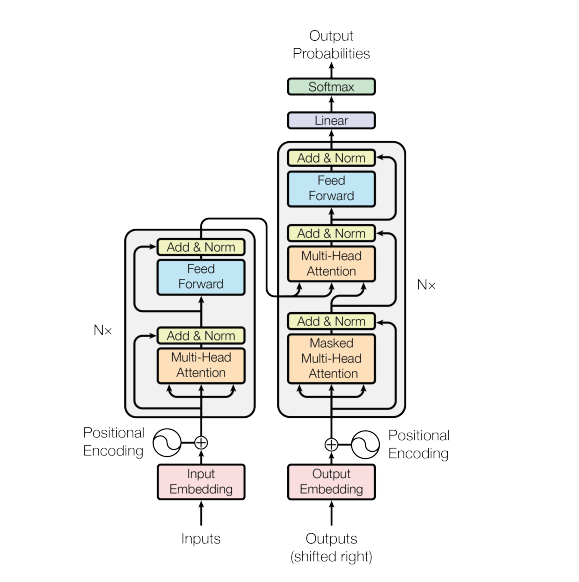

# Transformer from Scratch with PyTorch

> Implémentation complète de l'architecture Transformer (Encoder) depuis zéro en utilisant uniquement **PyTorch**, inspirée du papier fondateur [*"Attention Is All You Need"*](https://arxiv.org/abs/1706.03762) (Vaswani et al., 2017).



---

## Table des matières

- [Présentation](#-présentation)
- [Architecture](#-architecture)
- [Composants implémentés](#-composants-implémentés)
- [Prérequis](#-prérequis)
- [Installation](#-installation)
- [Utilisation](#-utilisation)
- [Entraînement](#-entraînement)
- [Résultats](#-résultats)
- [Structure du projet](#-structure-du-projet)
- [Références](#-références)

---

## Présentation

Ce projet a pour objectif de **démystifier l'architecture Transformer** en l'implémentant entièrement depuis zéro, sans s'appuyer sur les modules pré-construits de PyTorch (`nn.Transformer`). Chaque composant — de l'encodage positionnel au mécanisme d'attention multi-têtes — est codé manuellement pour une compréhension approfondie.

Le modèle est ensuite utilisé comme **modèle de langage (Language Model)** entraîné sur le dataset **Tiny Shakespeare** pour la génération de texte caractère par caractère.

### Objectifs pédagogiques

- Comprendre le fonctionnement interne du mécanisme d'**Attention**
- Implémenter le **Positional Encoding** sinusoïdal
- Construire le **Multi-Head Attention** depuis les projections Q, K, V
- Assembler un **Encoder Transformer** complet
- Ajouter une **tête de prédiction** pour la modélisation de langage
- Entraîner et **générer du texte** autoregressif

---

## Architecture

Le projet implémente la partie **Encoder** de l'architecture Transformer originale, augmentée d'une tête de prédiction linéaire pour la génération de texte.

```
Input Tokens
     │
     ▼
┌──────────────────┐
│   Embedding      │  (vocab_size → d_model)
└──────────────────┘
     │
     ▼
┌──────────────────┐
│ Positional       │  Encodage sinusoïdal
│ Encoding         │  sin/cos sur les positions
└──────────────────┘
     │
     ▼
┌──────────────────────────────────┐
│        Encoder Layer × N         │
│  ┌────────────────────────────┐  │
│  │  Multi-Head Attention      │  │
│  │  + Residual + LayerNorm    │  │
│  └────────────────────────────┘  │
│  ┌────────────────────────────┐  │
│  │  Feed Forward Network      │  │
│  │  + Residual + LayerNorm    │  │
│  └────────────────────────────┘  │
└──────────────────────────────────┘
     │
     ▼
┌──────────────────┐
│   LayerNorm      │
└──────────────────┘
     │
     ▼
┌──────────────────┐
│  Linear Head     │  (d_model → vocab_size)
└──────────────────┘
     │
     ▼
  Logits / Loss
```

---

## Composants implémentés

### 1. `PositionalEncoding`

Ajoute une information de position aux embeddings grâce aux fonctions sinusoïdales, permettant au modèle de distinguer l'ordre des tokens dans une séquence.

```
PE(pos, 2i)   = sin(pos / 10000^(2i/d_model))
PE(pos, 2i+1) = cos(pos / 10000^(2i/d_model))
```

| Paramètre | Description | Valeur par défaut |
|-----------|-------------|-------------------|
| `d_model` | Dimension du modèle | — |
| `max_len` | Longueur maximale de la séquence | `5000` |

---

### 2. `ScaledDotProductAttention`

Cœur du mécanisme d'attention. Calcule les scores d'attention à partir des matrices **Query (Q)**, **Key (K)** et **Value (V)** :

$$
\text{Attention}(Q, K, V) = \text{softmax}\left(\frac{QK^T}{\sqrt{d_k}}\right) V
$$

- **Scaling** par `√d_k` pour stabiliser les gradients
- Support d'un **mask** optionnel (pour l'attention causale ou le padding)

---

### 3. `MultiHeadAttention`

Projette Q, K, V en `num_heads` sous-espaces indépendants, applique l'attention sur chacun, puis concatène et projette le résultat.

```python
# Projections linéaires
Q = Wq(x)    # (batch, seq, d_model)
K = Wk(x)
V = Wv(x)

# Split en têtes
Q = Q.view(batch, seq, num_heads, d_k).transpose(1, 2)
# → (batch, num_heads, seq, d_k)

# Attention par tête + concat + projection finale
output = fc(concat(head_1, ..., head_h))
```

| Paramètre | Description |
|-----------|-------------|
| `d_model` | Dimension du modèle |
| `num_heads` | Nombre de têtes d'attention |
| `d_k` | Dimension par tête (`d_model / num_heads`) |

---

### 4. `FeedForward`

Réseau feed-forward à deux couches avec activation **ReLU** :

```
FFN(x) = ReLU(x · W₁ + b₁) · W₂ + b₂
```

| Paramètre | Description | Valeur par défaut |
|-----------|-------------|-------------------|
| `d_model` | Dimension d'entrée/sortie | — |
| `d_ff` | Dimension cachée | `2048` |

---

### 5. `EncoderLayer`

Un bloc complet de l'Encoder, composé de :

1. **Multi-Head Attention** + Connexion résiduelle + LayerNorm
2. **Feed Forward** + Connexion résiduelle + LayerNorm
3. **Dropout** (p=0.1) pour la régularisation

---

### 6. `TransformerEncoder`

Empile N couches `EncoderLayer` précédées d'un embedding et d'un encodage positionnel.

| Paramètre | Description |
|-----------|-------------|
| `vocab_size` | Taille du vocabulaire |
| `d_model` | Dimension du modèle |
| `num_heads` | Nombre de têtes d'attention |
| `num_layers` | Nombre de couches Encoder |
| `d_ff` | Dimension du FFN |
| `max_len` | Longueur max de séquence |

---

### 7. `TransformerLM`

Modèle de langage complet utilisant l'Encoder Transformer avec une **tête de prédiction linéaire** pour la génération de texte. Calcule la **cross-entropy loss** lorsque des cibles sont fournies.

| Paramètre | Valeur utilisée |
|-----------|----------------|
| `d_model` | `128` |
| `heads` | `4` |
| `layers` | `4` |
| `d_ff` | `512` (4 × d_model) |

---

## Prérequis

- **Python** ≥ 3.8
- **PyTorch** ≥ 1.9
- **requests** (pour le téléchargement du dataset)

---

## Installation

```bash
# Cloner le dépôt
git clone https://github.com/kokou-stm/transformers_from_scratch.git
cd code-transformers

# Installer les dépendances
pip install torch requests
```

---

## Utilisation

### Exécution du notebook

Le projet est contenu dans un **Jupyter Notebook** exécutable sur Google Colab ou en local :

```bash
jupyter notebook Transformers_from_Scratch_with_Pytorch.ipynb
```

### Test rapide de l'Encoder

```python
import torch

vocab_size = 10000
d_model = 512
num_heads = 8
num_layers = 6
d_ff = 2048

model = TransformerEncoder(vocab_size, d_model, num_heads, num_layers, d_ff)

# Batch de 32 séquences de 50 tokens
x = torch.randint(0, vocab_size, (32, 50))
out = model(x)

print(out.shape)  # torch.Size([32, 50, 512])
```

### Génération de texte

```python
print(generate(model, "KING", max_new_tokens=200))
```

---

## Entraînement

### Dataset

Le modèle est entraîné sur le dataset [**Tiny Shakespeare**](https://raw.githubusercontent.com/karpathy/char-rnn/master/data/tinyshakespeare/input.txt) (~1 Mo de texte), un corpus contenant l'intégralité des œuvres de Shakespeare concaténées.

### Tokenisation

Tokenisation **au niveau du caractère** (character-level) :

- Vocabulaire : ensemble des caractères uniques du corpus
- Encodage : chaque caractère → un entier
- Décodage : chaque entier → le caractère correspondant

### Hyperparamètres d'entraînement

| Paramètre | Valeur |
|-----------|--------|
| Taille du vocabulaire | 65 (caractères uniques) |
| `d_model` | 128 |
| Têtes d'attention | 4 |
| Couches Encoder | 4 |
| `d_ff` | 512 |
| `block_size` | 64 |
| `batch_size` | 32 |
| Optimiseur | AdamW |
| Learning rate | 3e-4 |
| Étapes d'entraînement | 5000 |
| Split train/val | 90% / 10% |

### Courbe de perte (Loss)

```
Step     Loss
─────────────────
   0     4.2293
 500     0.3114
1000     0.0521
1500     0.0416
2000     0.0424
2500     0.0394
3000     0.0354
3500     0.0407
4000     0.0461
4500     0.0321
```

> La loss converge rapidement vers **~0.03**, indiquant que le modèle apprend efficacement les patterns du texte Shakespearien au niveau caractère.

---

## Structure du projet

```
code-transformers/
├── Transformers_from_Scratch_with_Pytorch.ipynb   # Notebook principal
├── image.png                                       # Diagramme de l'architecture Transformer
└── README.md                                       # Ce fichier
```

---

## Références

1. **Vaswani, A., et al.** (2017). [*Attention Is All You Need*](https://arxiv.org/abs/1706.03762). Advances in Neural Information Processing Systems (NeurIPS).
2. **Karpathy, A.** [char-rnn](https://github.com/karpathy/char-rnn) — Dataset Tiny Shakespeare.
3. **PyTorch Documentation** — [torch.nn](https://pytorch.org/docs/stable/nn.html).

---

## Licence

Ce projet est à vocation éducative. Libre d'utilisation et de modification.

---

<p align="center">
  <i>Fait avec PyTorch</i>
</p>
